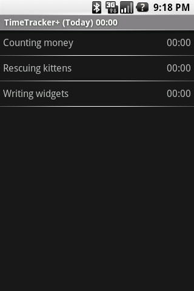
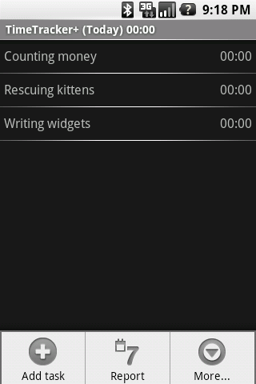
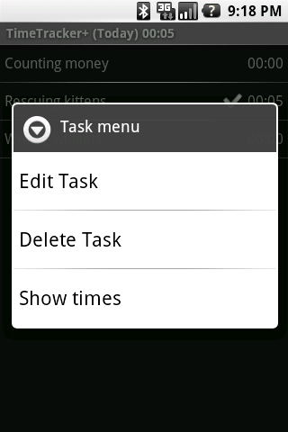

.. sectnum::

================================
          TimeTracker
================================
:Version: Version 2010.3 / 2010-01-19
:Author:  Sean E. Russell

TimeTracker helps you record the amount of time you spend on activities; for
example, for recording time in a time sheet at work. It provides ways to view,
edit, and filter times, and provides a time sheet report as well.

.. contents:: 
  :depth: 3

Features
===========================

- Tabular weekly summary report
- Variable date range views
- Export date range as CSV
- Back up database to SD card
- 12/24 hour format
- Font size
- Concurrent or exclusive time tracking
- Week start-day
- Audio and/or vibrate on start/stop timing

Usage
===========================

The Task View
-------------

The main application view is the task view. This shows all of the tasks and a
sum of their times for a selected date range. This is the main view where time
is tracked.

To start the timer for a task, tap on the task in the task list. To stop
timing, tap it again; or, tap a different task to switch timing to the other
task. Two tasks can not be running at the same time.

.. image:: img/running_task.png

Press your device's `Menu` button to get the `Tasks Menu`_, or press-and-hold on
a task to get the `Task Context Menu`_.

Tasks Menu
~~~~~~~~~~

Tasks are added by using the Task view menu's Add Task option, which opens a
dialog asking for the task name and adds a new task to the task list. Cancel
this dialog to abort the addition.

The Report_ menu option opens the weekly report.

The More_ menu option shows a larger menu.

Task Context Menu
~~~~~~~~~~~~~~~~~~

Edit Task
  Opens a dialog that can be used to change the name of a task.

Show times
  The `Show times`_ option opens a screen with a log of the times for a task
  (for the currently selected time range).

Delete task
  Deletes a task, and all of the times for the task. **This action can not be
  undone!** A confirmation dialog will be displayed before the task is deleted;
  cancel the confirmation dialog to abort the action.

.. _More:

Extended Menu (``More...``)
---------------------------

.. image:: img/extended_menu.png

This menu provides access to the following functions:

Change date range
  Opens the `Change Date Range`_ dialog, allowing you to alter which times are
  displayed in the both `The Task View`_ (the main view, which is a summary of
  times for the range), and in `The Time Log`_ (the ``Show Times`` option in a
  task's context menu).

Export view to CSV
  Saves the current times for all tasks for the currently selected range to the
  SD card as a comma-separated file.  Only times for the currently selected
  range are exported; if you have the current range set to "Today", then only
  times that started today will be exported.

Copy DB to SD card
  Backs up the TimeTracker+ database to the SD card.  This overwrites any
  previous back-up.

Preferences
  Opens the extended preferences dialog.

Help
  Shows an "about" dialog, with the TimeTracker+ version and brief help
  information.

Change Date Range
~~~~~~~~~~~~~~~~~

.. image:: img/change_view.png

The Change view menu item can be used to change the range of times summed for
the tasks. Options are:

 * Today
 * Yesterday
 * This week
 * Last week
 * All times
 * Select a range

Times are filtered by their start date; **if a time event crosses a day boundary
into a day that is out of the currently selected view range, the entire range
will still be included in the sum**; however, none of that time will appear on
the next day, so times will only appear once.

For example, if the view is set to Yesterday and there is a time event that
started at 23:00 on that day and stops at 01:00 today, then the 2 hours will be
included in the sum of that task for this view. If the the view is then switched
to Today then that time range will not be included in this view.

A report of the times for the week can be displayed using the Report option of
the main menu.

.. _Report:

The Report view (weekly sum of all tasks)
-----------------------------------------

.. image:: img/report.png

Use the Report menu item to view a report of the daily time sums per task for an
entire week. The right-most column lists the totals per task for the week; the
bottom-most row lists the totals of all tasks for the day. Each cell shows the
total for a task, for a day.

The currently running time is included in the display, but is not updated in
real-time.

.. _Show times:

The Time log
------------

.. image:: img/task_times.png

The Time log displays a detailed list of times for a single task. The list is
filtered on the same range view that is currently selected for the main task
view; if it is set to Today, then only times for today will be shown.

As is the case for the main Task view, if a time range spans days that are not
in the selected view, then it will be displayed for the view on which the time
starts. See the example in the Task view for more information.

The Time log view main menu (the menu button)
~~~~~~~~~~~~~~~~~~~~~~~~~~~~~~~~~~~~~~~~~~~~~

.. image:: img/task_times_menu.png

The menu for the Time log contains a single entry for adding a new time range.

Use the Add Time option to manually insert times into the time log.

Note that TimeTracker+ will not prevent you from creating times that overlap
with times in other, or the same, task.

The Time log view context menu (press-hold on a time)
~~~~~~~~~~~~~~~~~~~~~~~~~~~~~~~~~~~~~~~~~~~~~~~~~~~~~

.. image:: img/task_times_context.png

The Time log context menu contains the following options:

Edit time
  This option can be used to adjust the start and end time of a time range. This
  option can also be more simply invoked by clicking on one of the times in the
  list.

Delete time
  A time can be removed by using this option. A confirmation dialog gives the
  user the option of aborting the action.

Bugs
===========
Please submit bugs by emailing the author.  You can see the list of known bugs
and planned features at the `TimeTracker ditz page`_.

Credits
=======
The TimeTracker application icon was borrowed from the excellent glyFX icon
library by `PerthWeb Pty Ltd`_.

.. _TimeTracker ditz page: http://ditz.germane-software.com/TimeTracker

.. _PerthWeb Pty Ltd: http://www.glyfx.com/ 
